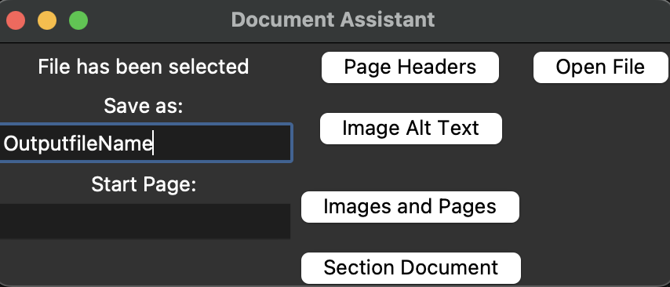

# Document Assistant

## How to install:

You will need to have python3 installed, uses the following: docx, tkinter, re.
Copy the git repo, and then use PyInstaller to make the executable file. (or any other methods of converting a python file to exe file)

## How-To Guide: Document Assistant:

### Getting started:

1. Name the output file (recommend a different name so it doesn't overwrite the original)
2. Make sure you have no word document open
3. Select **Open**, and pick the file you want to remediate

### Convert Pages to Heading Level 6:

1. Your ***Document must contain a heading level 6.*** To do this, open the document you want to remediate and create headings until you create a heading level 6 then ***save and exit*** the document

2. Put the starting page number in the text field under **"Start Page:**

3. Select **Page Headers**

***Note: only put in Arabic Numerals (1,2,3,4...), No Roman Numerals, etc.***

### Place Alt Text Reminders:

1. Your ***Document must contain a heading level 7.*** To do this, open the document you want to remediate and create headings until you create a heading level 7. then ***save and exit*** the document
2. Select **Image Alt Text**

### Remindres for Alt Text and Pages to Heading Level 6:

1. Complete Step 2 in the "Convert Pages to Heading Level 6" Section
2. Complete Step 1 in the "Place Alt Text Reminders" Sections
3. Select **Images and Pages**

### Sections to Headings:

1. You can convert sections to headings too, first make a new word document.
2. Type the Heading level (Only goes up to 6 Heading levels). The format for this is the following: H1, H2, H3, H4, H5, H6
3. After you type the heading you want any paragraph beneath it will convert to the heading level you typed, type the sections you want to be that heading.
4. You **must type the sections the same as they appear in the book,** however, it is not case or space sensitive.
5. Save and exit the document, make sure you complete the getting started section
6. Select the document using **Section Document**, it will start automatically and convert the sections to headings

#### Example of how the Section Document looks:

H1  
This it the Title  
H2  
Section1  
Section2  
Section3  
H3  
Section1.1  
Section2.1  
Section3.1  

## Results

### Before

### After

